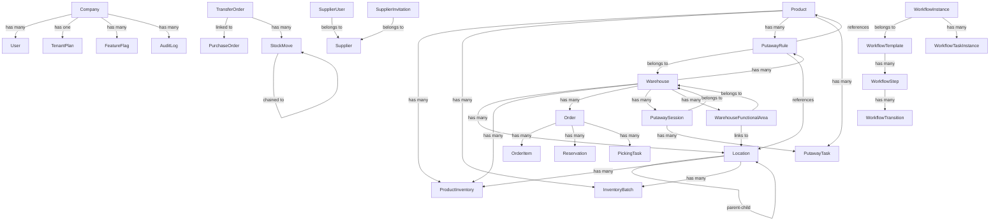
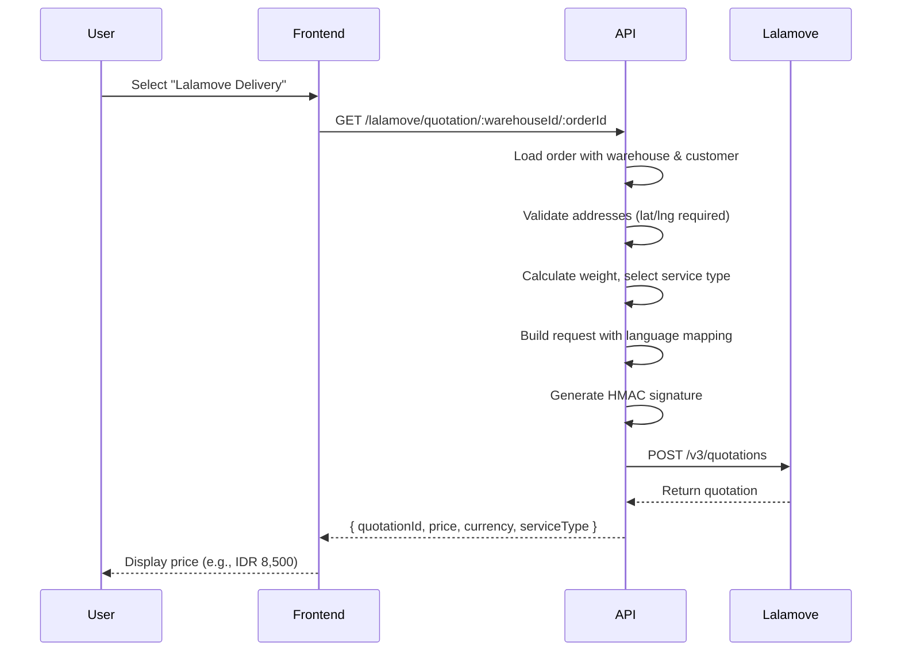

# Labamu WMS - System Architecture

**Version:** 5.0  
**Last Updated:** May 9, 2026  
**Status:** Production-Ready

---

## Table of Contents

1. [System Overview](#system-overview)
2. [Design Principles](#design-principles)
3. [Architecture](#architecture)
4. [Core Components](#core-components)
5. [API Structure](#api-structure)
6. [Data Model](#data-model)
7. [Security & Authorization](#security--authorization)
8. [Multi-Tenancy Architecture](#multi-tenancy-architecture)
9. [Backoffice Admin Portal](#backoffice-admin-portal)
10. [Supplier Portal](#supplier-portal)
11. [Integration Points](#integration-points)

---

## System Overview

Labamu WMS is a comprehensive warehouse management system built on a modern, scalable architecture. The system manages end-to-end warehouse operations including inventory management, inbound/outbound logistics, picking, putaway, order fulfillment, and reporting.

### Technology Stack

| Layer | Technology |
|-------|------------|
| **Frontend** | Next.js 16 (React), TypeScript, TailwindCSS |
| **Backend** | NestJS (Node.js), TypeScript |
| **Database** | PostgreSQL / SQLite (via Prisma ORM) |
| **API Protocol** | REST (JSON) |
| **Authentication** | Cookie-based sessions with role-based access control (RBAC) |
| **Testing** | Playwright (E2E), Jest (Unit) |

---

## Design Principles

### 1. **Separation of Concerns**
- Clear separation between frontend (Next.js) and backend (NestJS)
- API proxy layer in Next.js routes requests to backend, avoiding CORS issues
- Business logic resides entirely in backend services

### 2. **Domain-Driven Design (DDD)**
- Modules organized by business domains (Inventory, Orders, Putaway, Picking, etc.)
- Each module contains Controllers, Services, and Domain Models
- Clear bounded contexts prevent tight coupling

### 3. **Location Hierarchy**
- All physical spaces modeled as `Location` entities with hierarchical relationships
- **Materialized Path:** Uses `fullAddress` (e.g., `WH1.ZONE-A.ROW-1`) for efficient querying of trees without recursive joins.
- **Capacity Constraints:** Locations define `innerDimensions` (L/W/H) and `maxWeightKg` to enforce physical limits during putaway.
- Supports warehouse structures: `WAREHOUSE → ROOM → ROW → BAY → SHELF → POSITION`
- Enables flexible spatial organization and zone-based optimization

### 4. **Flexible Putaway Strategy**
- **Rule-Based System**: Configurable `PutawayRule` entities with matching criteria and destination strategies
- **Fallback Heuristics**: Velocity-based location assignment when no rules match
- **5 Strategies**: FIXED, ZONE_PRIORITY, CLOSEST, LEAST_OCCUPIED, BALANCED

### 5. **Batch & Lot Tracking**
- Products support three tracking modes: `none`, `lot`, `serial`
- `InventoryBatch` provides granular traceability with lot numbers, expiry dates, and FEFO rotation
- First-Expired-First-Out (FEFO) and FIFO removal strategies

### 6. **Multi-Warehouse Support**
- All inventory, orders, and operations are warehouse-scoped
- Inter-warehouse transfers via `TransferOrder` and `StockMove`
- Warehouse-specific configurations (inbound/outbound steps, functional areas)

### 7. **Role-Based Access Control (RBAC)**
- Users assigned to warehouses with specific roles
- Permissions defined as `{resource}:{action}` (e.g., `INVENTORY:CREATE`)
- Fine-grained access control on all endpoints via `@Permission()` decorators

### 8. **Audit Trail**
- All inventory changes tracked via `StockTransaction`
- Immutable transaction records with timestamps and user attribution
- Full history for compliance and troubleshooting

---


### 9. **Mobile-First Worker UX**
- Dedicated Next.js Route Group `(mobile)` for isolated layouts
- Simplified UI optimized for touch targets and handheld scanners
- Context-aware navigation (Back/Home/Exit)

### 10. **Multi-Tenancy (Row-Level Isolation)**
- Every tenant (company) is a logical silo in a shared PostgreSQL database
- A Prisma middleware layer automatically injects `WHERE companyId = ?` on all queries for tenant-scoped models
- `TENANT_SCOPED_MODELS = ['Product','Warehouse','Supplier','Customer','User','Role']`
- Cross-tenant operations (e.g., admin reporting) bypass isolation via `runWithoutTenant(fn)`, which executes the callback with `companyId: null` inside an AsyncLocalStorage context

### 11. **Platform Administration Separation**
- Tenant admins carry `*:MANAGE` permissions and can manage their own company's resources
- Platform admins (Labamu staff) carry `ALL:MANAGE` — a literally different resource name, not a wildcard match
- `PermissionsGuard` performs a strict resource comparison: when `requiredPermission.resource === 'ALL'`, only a permission where `p.resource === 'ALL'` satisfies the check
- This prevents tenant admins from accessing any platform-level endpoint

---

## Architecture

### High-Level Architecture

```
┌─────────────────────────────────────────────────────────────┐
│                     Client Browser                           │
│                                                               │
│  ┌─────────────────────────────────────────────────────┐   │
│  │           Next.js Frontend (Port 3000)               │   │
│  │  • React Components (Pages, UI)                      │   │
│  │  • API Proxy Routes (/api/*)                         │   │
│  │  • Auth Context (useAuth)                            │   │
│  │  • Client-side State Management                      │   │
│  └──────────────────────┬──────────────────────────────┘   │
└─────────────────────────┼────────────────────────────────────┘
                          │ HTTP (JSON)
                          ▼
┌─────────────────────────────────────────────────────────────┐
│              NestJS Backend API (Port 3001)                  │
│                                                               │
│  ┌─────────────┐  ┌─────────────┐  ┌─────────────┐         │
│  │  Controller │  │  Controller │  │  Controller │  ...    │
│  │   Layer     │  │   Layer     │  │   Layer     │         │
│  └──────┬──────┘  └──────┬──────┘  └──────┬──────┘         │
│         │                 │                 │                │
│  ┌──────▼──────┐  ┌──────▼──────┐  ┌──────▼──────┐         │
│  │   Service   │  │   Service   │  │   Service   │  ...    │
│  │   Layer     │  │   Layer     │  │   Layer     │         │
│  └──────┬──────┘  └──────┬──────┘  └──────┬──────┘         │
│         │                 │                 │                │
│         └─────────────────┴─────────────────┘                │
│                           │                                   │
│                  ┌────────▼────────┐                         │
│                  │  Prisma Service │                         │
│                  │  (ORM Layer)    │                         │
│                  └────────┬────────┘                         │
└───────────────────────────┼──────────────────────────────────┘
                            │
                            ▼
                   ┌────────────────┐
                   │   PostgreSQL   │
                   │    Database    │
                   └────────────────┘
```

### Request Flow

1. **Client Request** → Next.js page makes API call
2. **API Proxy** → Next.js route (`/api/*`) proxies to NestJS backend
3. **Controller** → Validates request, checks permissions, delegates to service
4. **Service** → Executes business logic, interacts with database via Prisma
5. **Response** → Data flows back through proxy to client

---

## Core Components

### Backend Modules

| Module | Responsibility | Key Services |
|--------|---------------|--------------|
| **InventoryModule** | Product catalog, stock levels, adjustments, **stock moves** | `InventoryService`, `PackagingService`, `StockMoveService` |
| **PutawayModule** | Inbound putaway operations, rule-based location assignment | `PutawayService`, `PutawayController` |
| **OrderModule** | Sales orders, fulfillment, reservations | `OrderService`, `FulfillmentService` |
| **PurchaseOrderModule** | Purchase orders, receipts, vendor management, **QA inspections, document attachments, 3-way match** | `PurchaseOrderService` |
| **PickingModule** | Order picking, picking sessions, task management | `PickingService` (integrated in Inventory) |
| **StrategyModule** | Reservation strategies, rotation rules | `StrategyService` |
| **WarehouseModule** | Warehouse configuration, locations, functional areas | `WarehouseService` |
| **FloorPlanModule** | Visual warehouse layout editor, drag-and-drop placement, spatial coordinates | `WarehouseService` (floor plan endpoints) |
| **SettingsModule** | Attributes, custom fields, system configuration | `AttributeService` |
| **AuthModule** | Authentication, user management, permissions | `AuthService` |
| **ReportingModule** | Analytics, dashboards, compliance reports, inventory ledger | `ReportingService`, `DrillDownService`, `InventoryLedgerService` |
| **IntegrationModule** | External system integrations, webhooks | `IntegrationService` |
| **StoModule** | Stock Transfer Orders (inter-warehouse) | `StoService` |
| **TransferModule** | Inter-warehouse transfer requests, approvals, tracking | `TransferService`, `TransferController` |
| **ShippingModule** | Carrier management, delivery methods | `ShippingService` |
| **InvoiceModule** | VAT invoicing, financial reporting | `InvoiceService` |
| **SupplierModule** | Supplier catalog, partner management | `SupplierService` |
| **ReturnsModule** | Returns Management (RMA), receiving, restocking conditions | `ReturnsService`, `ReturnsController` |
| **StocktakingModule** | Cycle counts, full stocktakes, reconciliation | `StocktakingService`, `StocktakingController` |
| **NotificationModule** | In-app notifications, expiry alerts, notification bell | `NotificationService`, `ExpiryCheckerService` |
| **PackingModule** | Packing queue, parcel management, packing sessions | `PackingService`, `PackingController` |
| **ReplenishmentModule** | Reorder point monitoring, auto-PO generation, alerts | `ReplenishmentService`, `ReplenishmentController` |
| **BarcodeModule** | Universal barcode lookup, context-aware validation | `BarcodeValidatorService` |
| **AnalyticsServices** (in InventoryModule) | ABC classification, pick accuracy, zone cycle counts | `AbcClassificationService`, `PickAccuracyService`, `CycleCountService`, `ReportingController` |
| **CompanyModule** | Multi-tenant company registry, backoffice operations | `CompanyService`, `PlanService`, `FeatureFlagService`, `AuditService`, `PlatformService` |
| **WorkflowModule** | Dynamic workflow templates, execution engine, step transitions, audit trail | `WorkflowTemplateController`, `WorkflowExecutionController` |
| **CurrencyModule** | Multi-currency support, exchange rate management | `CurrencyController` |
| **PrintingModule** | Printer configuration, barcode label printing | `PrintingController`, `PrinterConfigController` |
| **PickingStrategiesModule** | Picking strategy CRUD, wave release rules | `PickingStrategiesController` |
| **SupplierPortalModule** | Supplier self-service portal — auth, invitation, PO visibility | `SupplierAuthController`, `SupplierPortalController` |
| **ConfigurationModule** | Delivery method CRUD (dual-prefix: `/configuration/delivery-methods` and `/delivery-methods`) | `DeliveryMethodsController`, `DeliveryMethodsAliasController` |

### Frontend Structure

```
apps/web/
├── app/                         # Next.js App Router
│   ├── api/                     # API Proxy Routes & Server-Side Handlers
│   │   ├── auth/
│   │   ├── admin/
│   │   │   └── impersonate/     # Sets/clears impersonation cookies
│   │   │       └── stop/
│   │   └── inventory/
│   │       ├── putaway-rules/
│   │       └── putaway/
│   │           └── sessions/
│   ├── (admin)/                 # Backoffice route group (ALL:MANAGE only)
│   │   ├── page.tsx             # Backoffice overview / KPI cards
│   │   ├── tenants/             # Tenant CRUD, bulk ops, invite
│   │   │   └── [id]/            # Tenant detail: tabs for Overview / Plan / Flags
│   │   ├── analytics/           # Platform-wide analytics with Recharts
│   │   ├── audit-log/           # Filterable platform audit trail
│   │   └── announcements/       # Create/manage in-app announcements
│   ├── (dashboard)/             # Main tenant dashboard route group
│   │   ├── inventory/           # Inventory Management
│   │   │   ├── [id]/            # Product detail
│   │   │   ├── batches/         # Lot/batch tracking
│   │   │   ├── packages/        # Packaging unitization
│   │   │   ├── locations/       # Location hierarchy + floor plan
│   │   │   ├── warehouses/      # Warehouse config + floor plan per warehouse
│   │   │   ├── routes/          # Inventory routes & route builder
│   │   │   ├── moves/           # Stock moves
│   │   │   ├── adjustments/     # Inventory adjustments
│   │   │   ├── cycle-counts/    # Cycle count dashboard
│   │   │   ├── ledger/          # Inventory ledger (virtual view)
│   │   │   ├── operations/      # Operations hub (incl. transit)
│   │   │   ├── suppliers/       # Supplier management
│   │   │   ├── purchases/       # Purchase orders + receive flow
│   │   │   ├── putaway-rules/   # Putaway rule configuration
│   │   │   ├── reordering-rules/# Reordering rules
│   │   │   ├── scrap/           # Scrap orders
│   │   │   └── replenishment/   # Replenishment alerts + forecasting
│   │   ├── orders/              # Sales order management (list, detail, new)
│   │   ├── customers/           # Customer management
│   │   ├── packing/             # Packing station + session detail
│   │   ├── shipments/           # Shipments list
│   │   ├── returns/             # Returns / RMA (list, new, receive flow)
│   │   ├── invoices/            # VAT invoicing
│   │   ├── stocktaking/         # Stocktake sessions (count + reconcile)
│   │   ├── transfers/           # Inter-warehouse transfer requests
│   │   ├── floor-plan/          # Global floor plan view
│   │   ├── reporting/           # Analytics, compliance, cycle-time, utilisation, ledger
│   │   ├── workflows/           # Workflow templates, monitor, analytics, builder
│   │   ├── notifications/       # In-app notification centre
│   │   ├── settings/            # System settings
│   │   │   ├── users/           # User management
│   │   │   ├── roles/           # Role & permission management
│   │   │   ├── attributes/      # Custom attribute definitions
│   │   │   ├── categories/      # Product category management
│   │   │   ├── fulfillment/     # Fulfillment rules
│   │   │   ├── lalamove/        # Lalamove integration settings
│   │   │   ├── api-keys/        # API key management
│   │   │   ├── printers/        # Printer configuration
│   │   │   ├── currencies/      # Currency & exchange rate management
│   │   │   └── seasonality/     # Seasonality profile management
│   │   ├── configuration/
│   │   │   └── delivery-methods/# Delivery method CRUD
│   │   ├── getting-started/     # Onboarding checklist
│   │   └── user-guide/          # Documentation
│   ├── (mobile)/                # Mobile Hub route group (simplified worker UX)
│   │   ├── dashboard/           # Mobile home
│   │   ├── picking/             # Picking task list + task detail
│   │   ├── putaway/             # Putaway task list + task detail
│   │   ├── stocktaking/         # Stocktaking session + detail
│   │   └── scan/                # Universal barcode scanner
│   ├── (supplier)/              # Supplier self-service portal route group
│   │   ├── login/               # Supplier login
│   │   ├── dashboard/           # Supplier dashboard (PO overview)
│   │   └── purchase-orders/[id] # PO detail for supplier
│   └── layout.tsx               # Root Layout
├── components/                  # Reusable UI Components
│   ├── ui/                      # shadcn/ui components
│   ├── Sidebar.tsx              # Main tenant navigation (collapsible sections)
│   ├── AdminNav.tsx             # Dark-slate sidebar for backoffice
│   ├── ImpersonationBanner.tsx  # Amber banner shown during tenant impersonation
│   └── auth/
│       └── PermissionGate.tsx
├── lib/                         # Utilities & API Clients
│   ├── api.ts                   # Core API client (fetchWithRetry)
│   ├── admin-api.ts             # Backoffice-specific API helpers
│   ├── auth.tsx                 # Auth Context
│   ├── putaway-api.ts           # Putaway-specific API
│   └── transfer-api.ts          # Transfer-specific API
└── hooks/                       # Custom React Hooks
    └── usePermission.ts
```

### Important: API Proxy vs UI Routes

You'll notice that `putaway` and `putaway-rules` appear in **two different locations** in the structure above. This is intentional and serves different purposes:

#### 1. **API Proxy Routes** (`app/api/...`)
These are **server-side** Next.js API routes that proxy requests to the NestJS backend. They do not render any UI.

```
app/api/inventory/putaway-rules/   ← Returns JSON (API proxy)
app/api/inventory/putaway/sessions/ ← Returns JSON (API proxy)
```

**Purpose**:
- Forward frontend requests from port 3000 → backend port 3001
- Solve CORS issues (same-origin policy)
- Handle authentication cookies seamlessly
- Return raw JSON data to frontend components

#### 2. **UI Page Routes** (`app/...`)
These are **user-facing** pages that render React components and provide actual user interfaces.

```
app/inventory/putaway-rules/   ← Renders UI for managing rules
app/putaway/                   ← Renders UI for putaway operations
```

**Purpose**:
- Display forms, tables, buttons, and interactive elements
- Handle user interactions
- Call API proxy routes to fetch/update data

#### Example Request Flow

```
1. User visits: http://localhost:3000/inventory/putaway-rules
                ↓
2. [UI Page Route renders React components]
                ↓
3. User clicks "Create Rule" button
                ↓
4. Frontend calls: fetch('/api/inventory/putaway-rules', { method: 'POST', ... })
                ↓
5. [API Proxy Route] receives request on same domain
                ↓
6. Proxy forwards to: http://127.0.0.1:3001/inventory/putaway-rules
                ↓
7. [NestJS Backend] processes request, returns JSON
                ↓
8. Proxy returns JSON to frontend
                ↓
9. UI updates with new data
```

**Why This Pattern?**

In Next.js, you **cannot** call external APIs directly from browser JavaScript due to CORS (Cross-Origin Resource Sharing) restrictions. The `/api/*` routes run on the server-side within the Next.js application, allowing them to make backend calls without CORS issues. The frontend then calls these same-origin `/api/*` endpoints instead of directly calling the backend.


## API Structure

### REST Endpoint Conventions

All endpoints follow RESTful patterns:

```
GET    /resource          List all items
GET    /resource/:id      Get single item
POST   /resource          Create new item
PATCH  /resource/:id      Update existing item
DELETE /resource/:id      Delete item
POST   /resource/:id/action  Trigger action on item
```

### Core API Endpoints

#### Authentication
```
POST   /auth/login              Login user
POST   /auth/logout             Logout user
GET    /auth/me                 Get current user with roles/permissions
```

#### Inventory Management
```
GET    /inventory/products                  List products (with filters)
GET    /inventory/products/:id              Get product details
POST   /inventory/products                  Create product
PATCH  /inventory/products/:id              Update product
DELETE /inventory/products/:id              Delete product

GET    /inventory/batch/:productId          Get batches for product
POST   /inventory/adjust                    Create adjustment
GET    /inventory/transactions              Get transaction history
POST   /inventory/scrap                     Create scrap order
```

#### Warehouse & Locations
```
GET    /warehouses                          List warehouses
GET    /warehouses/:id                      Get warehouse details
POST   /warehouses                          Create warehouse
GET    /warehouses/:id/locations            Get location hierarchy
POST   /warehouses/:id/locations            Create location
PATCH  /locations/:id                       Update location
DELETE /locations/:id                       Delete location (Safe Delete)
GET    /locations/:id/dependencies          Check for blocking dependencies
```

#### Purchase Orders
```
GET    /purchase-orders                     List POs
GET    /purchase-orders/:id                 Get PO details
POST   /purchase-orders                     Create PO
PATCH  /purchase-orders/:id                 Update PO
POST   /purchase-orders/:id/receive         Receive PO items (generate GRN)
POST   /purchase-orders/:id/close           Close PO
POST   /purchase-orders/:id/documents       Upload document (multipart)
GET    /purchase-orders/:id/documents       List attached documents
POST   /purchase-orders/:id/inspections     Submit QA inspection results
GET    /purchase-orders/:id/inspections     List QA inspections
POST   /purchase-orders/:id/match           Run 3-way match verification
```

#### Floor Plan & Routing
```
GET    /warehouses/:id/floor-plan           Get floor plan objects
PATCH  /warehouses/:id/floor-plan           Update object positions
GET    /warehouses/:id/areas                List functional areas
POST   /warehouses/:id/areas                Create floor plan object
GET    /floorplan/:warehouseId/export       Export floor plan to CSV
POST   /floorplan/:warehouseId/import       Import floor plan from CSV
GET    /routing/:warehouseId/distance       Get distance between two points
```

#### Sales Orders
```
GET    /orders                              List orders
GET    /orders/:id                          Get order details
POST   /orders                              Create order
PUT    /orders/:id                          Full update (delivery method, warehouse, status, priority)
PATCH  /orders/:id                          Partial update (same handler as PUT)
POST   /orders/:id/check-availability       Reserve inventory
POST   /orders/:id/cancel                   Cancel order (release stock)
POST   /orders/ship                         Create shipment (mark order SHIPPED)
DELETE /orders/:id                          Delete order (only PENDING empty or CANCELLED)
```

#### Putaway Operations
```
POST   /inventory/putaway/sessions          Create putaway session
GET    /inventory/putaway/sessions/:warehouseId/active  Get active session
PATCH  /inventory/putaway/tasks/:id         Update putaway task
PATCH  /inventory/putaway/sessions/:id/complete  Complete session
GET    /inventory/putaway/tasks/blocked     Get blocked tasks
```

#### Putaway Rules
```
GET    /inventory/putaway-rules             List putaway rules
GET    /inventory/putaway-rules/:id         Get rule details
POST   /inventory/putaway-rules             Create rule
PATCH  /inventory/putaway-rules/:id         Update rule
DELETE /inventory/putaway-rules/:id         Delete rule
```

#### Picking Operations
```
POST   /strategy/picking/sessions                     Create picking session (SINGLE, ZONE, BATCH, WAVE)
GET    /strategy/picking/sessions/:id/picklist         Get session picklist
PATCH  /strategy/picking/tasks/:id                     Update picking task status
POST   /strategy/picking/sessions/:id/complete         Complete session
```

#### Returns Management
```
GET    /returns/order/:orderId              Get returns by order
POST   /returns                             Create return request
POST   /returns/:id/receive                 Receive & assess items
```

#### Stocktaking
```
GET    /stocktaking/sessions                List sessions
POST   /stocktaking/sessions                Create session
POST   /stocktaking/sessions/:id/tasks      Generate tasks
GET    /stocktaking/sessions/:id/tasks      List tasks
POST   /stocktaking/tasks/:id/count         Submit count
POST   /stocktaking/sessions/:id/reconcile  Approve adjustments
```

#### Transfer Operations
```
GET    /transfers                           List transfer requests
GET    /transfers/:id                       Get transfer details
POST   /transfers                           Create transfer request
POST   /transfers/:id/approve               Approve transfer
POST   /transfers/:id/cancel                Cancel transfer
PATCH  /transfers/:id                       Update transfer details
```

#### Notifications
```
GET    /notifications                       List notifications
GET    /notifications/unread-count          Unread notification count
POST   /notifications                       Create notification
PATCH  /notifications/:id/read              Mark as read
POST   /notifications/mark-all-read         Mark all as read
POST   /notifications/check-expiry          Run expiry checker
```

#### Packing Station
```
GET    /packing/queue                       List orders ready for packing
POST   /packing/sessions                    Start packing session
GET    /packing/sessions/:id                Get session details
POST   /packing/sessions/:id/parcels        Add parcel to session
POST   /packing/sessions/:id/complete       Complete packing session
```

#### Replenishment & Forecasting
```
GET    /replenishment/rules                 List reordering rules
POST   /replenishment/rules                 Create reordering rule
GET    /replenishment/summary               Replenishment summary
GET    /replenishment/alerts                List active replenishment alerts
POST   /replenishment/check                 Check stock against reorder points
POST   /replenishment/alerts/:id/auto-po    Auto-create PO from alert
POST   /replenishment/alerts/:id/dismiss    Dismiss alert
POST   /replenishment/forecast/run          Run forecasts for company
GET    /replenishment/forecast/accuracy     Forecast accuracy metrics
GET    /replenishment/forecast/readiness    Data readiness check
GET    /replenishment/forecast/:productId   Forecast for specific product
GET    /replenishment/seasonality           List seasonality profiles
POST   /replenishment/seasonality           Create seasonality profile
POST   /replenishment/seasonality/:id/periods  Add seasonality period
POST   /replenishment/seasonality/periods/:id  Delete seasonality period
```

#### Delivery Methods
```
GET    /configuration/delivery-methods      List delivery methods (config route)
GET    /delivery-methods                    List delivery methods (alias)
POST   /delivery-methods                    Create delivery method
PUT    /delivery-methods/:id                Update delivery method
DELETE /delivery-methods/:id                Delete delivery method
```

#### Settings
```
GET    /settings/users                      List users
GET    /settings/users/:id                  Get user
PATCH  /settings/users/:id                  Update user
GET    /settings/roles                      List roles
POST   /settings/roles                      Create role
DELETE /settings/roles/:id                  Delete role
GET    /settings/roles/available-permissions  Available permission list
GET    /settings/attributes                 List attribute definitions
POST   /settings/attributes                 Create attribute definition
GET    /settings/categories                 List categories
POST   /settings/categories                 Create category
GET    /settings/categories/:id             Get category
PATCH  /settings/categories/:id             Update category
DELETE /settings/categories/:id             Delete category
```

#### Multi-Currency
```
GET    /currencies                          List currencies
POST   /currencies                          Add currency
DELETE /currencies/:code                    Remove currency
GET    /currencies/rates                    List exchange rates
POST   /currencies/rates                    Set exchange rate
```

#### Wave Release Rules
```
GET    /picking-strategies/wave-rules       List wave release rules
POST   /picking-strategies/wave-rules       Create wave rule
PUT    /picking-strategies/wave-rules/:id   Update wave rule
DELETE /picking-strategies/wave-rules/:id   Delete wave rule
```

#### Workflow Engine
```
GET    /workflows                           List workflow templates
POST   /workflows                           Create workflow template
GET    /workflows/:id                       Get template with steps
POST   /workflows/:id/steps                 Add step to template
POST   /workflow-instances                  Start workflow instance
GET    /workflow-instances/:id              Get instance status
POST   /workflow-instances/:id/advance      Advance to next step
```

#### Supplier Portal
```
POST   /supplier-auth/invite                Invite supplier user (admin)
POST   /supplier-auth/register              Supplier self-registration via token
POST   /supplier-auth/login                 Supplier login
GET    /supplier-portal/purchase-orders     List POs visible to supplier (JWT auth)
GET    /supplier-portal/purchase-orders/:id Get PO detail
```

#### Barcode Validation
```
POST   /barcode/lookup                      Universal barcode lookup (Product/Location/Batch)
POST   /barcode/validate                    Context-aware barcode validation
```

#### Tenant & Company Management (ALL:MANAGE only)
```
POST   /companies/register                  Self-service company registration (public)
GET    /companies                           List all companies / tenants
GET    /companies/:id                       Get company details + users
PATCH  /companies/:id                       Update company info
PATCH  /companies/:id/status               Update company status (ACTIVE|SUSPENDED|CANCELLED)
POST   /companies/:id/invite               Invite a user to a company
GET    /companies/:id/health               Tenant health metrics (users, last login, days inactive)
GET    /companies/:id/metrics              Tenant usage counts (products, orders, warehouses…)
GET    /companies/:id/onboarding           Onboarding checklist progress
GET    /companies/:id/plan                 Get current TenantPlan record
PUT    /companies/:id/plan                 Upsert plan configuration (tier, limits, trial)
GET    /companies/:id/plan/limits          Effective limits + current usage for each dimension
GET    /companies/:id/feature-flags        Get all feature flags for a company
PUT    /companies/:id/feature-flags/:key   Toggle a specific feature flag
POST   /companies/:id/impersonate          Generate 15-min impersonation JWT scoped to tenant
PATCH  /companies/bulk/status              Bulk update status across multiple companies
PATCH  /companies/bulk/plan                Bulk update plan across multiple companies
```

#### Platform Operations (ALL:MANAGE only)
```
GET    /platform/analytics                 Platform-wide KPIs + charts data
GET    /platform/audit-log                 Paginated audit log (limit param)
GET    /platform/announcements             List all announcements
GET    /platform/announcements/active      Active announcements (filterable by companyId/plan)
POST   /platform/announcements             Create announcement
DELETE /platform/announcements/:id         Delete announcement
GET    /feature-flags/available            List all known feature flag definitions
```

#### Analytics & Reporting
```
POST   /inventory/abc-classification/:warehouseId/run  Run ABC auto-classification
GET    /reporting/pick-accuracy/:warehouseId  Get pick accuracy metrics
GET    /reporting/cycle-count/:warehouseId    Zone-scoped inventory counts
GET    /shipping/rates                        Multi-carrier rate comparison
```

#### Purchase Order Scanning
```
POST   /purchase-orders/:id/scan-receive     Scan-to-receive (barcode)
```

### API Request/Response Formats

#### Standard Success Response
```json
{
  "id": "uuid",
  "name": "Product Name",
  "status": "Active",
  "createdAt": "2024-12-28T10:00:00Z"
}
```

#### Standard Error Response
```json
{
  "statusCode": 400,
  "message": "Validation failed: SKU already exists",
  "error": "Bad Request"
}
```

#### Pagination
```json
{
  "data": [...],
  "total": 150,
  "page": 1,
  "limit": 50
}
```

---

## Data Model

### Core Entities

#### Product
```typescript
Product {
  id: string (UUID)
  sku: string (unique)
  name: string
  category: string
  classification: string?  // ABC classification
  type: string?            // Raw, Finished, Semi-finished
  unitOfMeasure: string?
  isStockable: boolean
  status: string
  averageCost: float
  tracking: string         // none, lot, serial
  
  // Packaging Unitization
  ti: int?                 // Trays per Inner (Cartons per Layer)
  hi: int?                 // Inners per Outer (Layers per Pallet)
  
  // Physical Dimensions
  width: float?  // cm
  height: float? // cm
  depth: float?  // cm
  weight: float? // kg
  
  // Warehouse Optimization
  velocity: string?        // A (Fast), B (Medium), C (Slow)
  abcClass: string?        // A (High value), B, C (Low value)
  
  // Storage Requirements (Phase 2)
  storageRequirements: string?  // JSON array
  temperatureMin: float?        // °C
  temperatureMax: float?        // °C
  preferredPackaging: string?   // PALLET, BOX, INDIVIDUAL
  stackable: boolean
  maxStackHeight: int?
  
  // Relations
  inventory: ProductInventory[]
  batches: InventoryBatch[]
  pickingTasks: PickingTask[]
  putawayTasks: PutawayTask[]
  putawayRules: PutawayRule[]
}
```

#### Location
```typescript
Location {
  id: string (UUID)
  name: string
  type: string  // VIEW, INTERNAL, VENDOR, CUSTOMER, etc.
  structuralType: string?  // WAREHOUSE, ROOM, ROW, BAY, SHELF, POSITION
  
  // Attributes & Configuration
  attributes: string?              // JSON (refrigerated, hazmat, etc.)
  supportedPackaging: string?      // JSON array
  removalStrategy: string?         // FIFO, LIFO, FEFO
  
  // Capacity
  maxVolume: float?  // m³ (Legacy)
  maxWeight: float?  // DEPRECATED (Use maxWeightKg)
  
  // Canonical Physical Dimensions (Phase 8)
  innerLength: float?    // mm
  innerWidth: float?     // mm
  innerHeight: float?    // mm
  maxWeightKg: float?    // kg (Canonical source of truth)
  
  // Floor Plan Coordinates
  x: float?  // Meters (relative to origin)
  y: float?  // Meters
  width: float?
  height: float?
  rotation: float?
  
  // Optimization
  zonePriority: int      // 1 = Golden Zone, 100 = Back of house
  putawaySequence: int   // Traversal order within zone
  
  // Hierarchy
  parentId: string?
  parent: Location?
  children: Location[]
  warehouseId: string?
  
  // Relations
  inventory: ProductInventory[]
  batches: InventoryBatch[]
}
```

#### Warehouse
```typescript
Warehouse {
  id: string (UUID)
  name: string
  shortName: string?  // Max 5 chars for labeling
  address: string?
  location: string    // JSON: { lat, lng }
  type: string
  
  // Route Configuration
  incomingSteps: string?          // 1_step, 2_steps, 3_steps
  outgoingSteps: string?
  dropshipSubcontractors: boolean
  resupplySubcontractors: boolean
  manufactureToResupply: boolean
  manufactureSteps: string?
  
  // Relations
  inventory: ProductInventory[]
  orders: Order[]
  pickingSessions: PickingSession[]
  putawaySessions: PutawaySession[]
  putawayRules: PutawayRule[]
  functionalAreas: WarehouseFunctionalArea[]
}
```

#### WarehouseFunctionalArea (Auto-Created)
```typescript
WarehouseFunctionalArea {
  id: string (UUID)
  warehouseId: string
  warehouse: Warehouse
  
  // Area Definition
  name: string              // e.g. "Receiving Dock", "Main Storage"
  areaType: string          // RECEIVING, STAGING, PUTAWAY_LANE, STORAGE, PICKING, PACKING, SHIPPING
  sequence: int             // Order in process flow
  active: boolean
  
  // Linked Location
  linkedLocationId: string?
  linkedLocation: Location?  // The actual INTERNAL location for this functional area
  
  // Floor Plan Visualization
  shapeType: string         // 'rectangle' | 'polygon'
  vertices: string?         // JSON array of {x, y} coordinates
  x: float                  // Position coordinates
  y: float
  width: float
  height: float
  rotation: float
  color: string?            // Hex color for UI display
  
  attributes: string?       // JSON: capacity, equipment, etc.
  createdAt: DateTime
  updatedAt: DateTime
}
```

**Automatic Functional Area Creation**

When a warehouse is created, the system automatically creates functional areas and their linked locations based on the `incomingSteps` and `outgoingSteps` configuration:

| Configuration | Auto-Created Functional Areas | Linked Locations Created |
|---------------|-------------------------------|-------------------------|
| **1-step** (Default) | RECEIVING, STORAGE, SHIPPING | "Receiving Dock", "Main Storage", "Shipping Dock" |
| **2-steps** | RECEIVING, STAGING, STORAGE, PICKING, SHIPPING | "Receiving Dock", "Staging Area", "Main Storage", "Picking Zone", "Shipping Dock" |
| **3-steps** | RECEIVING, STAGING, PUTAWAY_LANE, STORAGE, PICKING, PACKING, SHIPPING | "Receiving Dock", "Staging Area", "Putaway Lane", "Main Storage", "Picking Zone", "Packing Station", "Shipping Dock" |

Each functional area:
- Gets a `WarehouseFunctionalArea` entry with explicit `areaType`
- Has a linked INTERNAL `Location` created automatically
- Is positioned on the warehouse floor plan for visualization
- Is identified by `areaType` enum (not name-based string matching)

**Benefits:**
1. **No Manual Setup Required**: Warehouses are immediately operational for putaway/picking
2. **Correct by Default**: Receiving locations always exist, preventing putaway errors
3. **Explicit Typing**: Uses `areaType` enum instead of fragile name matching
4. **Flexible**: Users can add more locations or functional areas later
5. **Process-Aligned**: Locations match the configured warehouse flow

#### PutawayRule (Phase 2 & 3)
```typescript
PutawayRule {
  id: string (UUID)
  name: string
  description: string?
  priority: int           // Higher = evaluated first
  active: boolean
  
  warehouseId: string?
  warehouse: Warehouse?
  
  // Matching Criteria (ALL must match)
  productId: string?
  product: Product?
  categoryId: string?
  velocityClass: string?      // A, B, C
  abcClassification: string?  // A, B, C
  storageRequirements: string?  // JSON array
  temperatureMin: float?
  temperatureMax: float?
  packagingSize: string?      // PALLET, BOX, INDIVIDUAL
  minWeight: float?
  maxWeight: float?
  sourceLocationId: string?   // Match items from specific receiving area
  
  // Destination Strategy
  strategy: string  // FIXED, ZONE_PRIORITY, CLOSEST, LEAST_OCCUPIED, BALANCED
  
  // Strategy-Specific Configuration
  destinationLocationId: string?  // For FIXED strategy
  minZonePriority: int?          // For ZONE_PRIORITY
  maxZonePriority: int?          // For ZONE_PRIORITY
  
  createdAt: DateTime
  updatedAt: DateTime
}
```

#### InventoryBatch
```typescript
InventoryBatch {
  id: string (UUID)
  productId: string
  product: Product
  
  locationId: string
  location: Location
  
  warehouseId: string
  warehouse: Warehouse
  
  quantity: float
  lotNumber: string?
  expiryDate: DateTime?
  
  // Quality Control
  status: string  // AVAILABLE, QUARANTINE, RESERVED, DAMAGED
  
  // Tracking
  createdAt: DateTime
  updatedAt: DateTime
}
```

#### Order
```typescript
Order {
  id: string (UUID)
  orderNumber: string (unique)
  customerId: string?
  customer: Customer?
  
  warehouseId: string
  warehouse: Warehouse
  
  type: string  // SALES, TRANSFER, PRODUCTION
  status: string  // DRAFT, PENDING, RESERVED, PICKING, PACKING, SHIPPED, DELIVERED, CANCELLED
  
  totalAmount: float
  currency: string?
  
  // Fulfillment
  reservationStatus: string  // NONE, PARTIAL, FULL
  fulfillmentStatus: string  // NONE, PARTIAL, FULL
  
  items: OrderItem[]
  reservations: Reservation[]
  pickingTasks: PickingTask[]
  
  createdAt: DateTime
  deliveryDate: DateTime?
}

> **Note on Returns:** Customer Returns are also modeled as `Order` entities with `type="RETURN"`. They reference the original Sales Order via `parentOrderId`.
```

#### StockTransaction
```typescript
StockTransaction {
  id: string (UUID)
  productId: string
  product: Product
  
  locationId: string
  location: Location
  
  transactionType: string  // IN, OUT, ADJUST, MOVE, RESERVE, UNRESERVE
  quantity: float
  
  batchId: string?
  batch: InventoryBatch?
  
  // References
  orderId: string?
  purchaseOrderId: string?
  adjustmentId: string?
  
  // Audit
  userId: string?
  notes: string?
  timestamp: DateTime
}

#### TransferOrder (New)
```typescript
TransferOrder {
  id: string (UUID)
  orderNumber: string (unique) // TO-20241230-001
  
  type: string // INBOUND_FLOW, OUTBOUND_FLOW, INTERNAL
  status: string // PROCESSING, DONE, CANCELLED
  
  sourceWarehouseId: string
  destinationWarehouseId: string
  
  // Progress
  totalSteps: int // e.g., 3
  currentStep: int // e.g., 2
  activeMoveId: string? // Pointer to current active move
  
  // Relations
  purchaseOrderId: string?
  moves: StockMove[]
}
```

#### StockMove (Enhanced)
```typescript
StockMove {
  id: string (UUID)
  transferOrderId: string?
  transferOrder: TransferOrder?
  
  sequence: int // 1, 2, 3
  status: string // PENDING, READY, DONE, CANCELLED, FAILED
  
  // Linking
  previousMoveId: string?
  nextMoveId: string?
  
  // Deviation Tracking
  inputQuantity: float // Expected
  outputQuantity: float // Actual
  exceptionReason: string? // "QC Failed", "Damaged"
}
```

#### StocktakeSession
```typescript
StocktakeSession {
  id: string (UUID)
  warehouseId: string
  status: string    // PLANNED, IN_PROGRESS, COMPLETED, CANCELLED
  type: string      // FULL, CYCLE_COUNT, SPOT_CHECK
  description: string?
  
  tasks: StocktakeTask[]
  
  createdBy: string?
  createdAt: DateTime
}
```

#### StocktakeTask
```typescript
StocktakeTask {
  id: string (UUID)
  sessionId: string
  session: StocktakeSession
  
  locationId: string
  location: Location
  
  productId: string?
  
  systemQuantity: int   // Expected
  countedQuantity: int? // Actual (Null = pending)
  
  status: string        // PENDING, COUNTED, VERIFIED
  
  countedBy: string?
  updatedAt: DateTime
}
```

#### SupplierUser & Invitation
```typescript
SupplierUser {
  id: string (UUID)
  supplierId: string
  supplier: Supplier
  email: string (unique)
  passwordHash: string
  isActive: boolean
  lastLoginAt: DateTime?
  createdAt: DateTime
}

SupplierInvitation {
  id: string (UUID)
  supplierId: string
  email: string
  token: string (unique)   // 64-char hex, shown once
  expiresAt: DateTime
  usedAt: DateTime?        // set on registration
  createdAt: DateTime
}
```

#### WorkflowTemplate & Execution
```typescript
WorkflowTemplate {
  id: string (UUID)
  name: string
  description: string?
  steps: WorkflowStep[]
  instances: WorkflowInstance[]
  createdAt: DateTime
}

WorkflowStep {
  id: string (UUID)
  templateId: string
  name: string
  action: string
  sequence: int
  transitions: WorkflowTransition[]
}

WorkflowInstance {
  id: string (UUID)
  templateId: string
  status: string   // RUNNING, COMPLETED, FAILED, CANCELLED
  currentStepId: string?
  tasks: WorkflowTaskInstance[]
  auditLogs: WorkflowAuditLog[]
  createdAt: DateTime
  completedAt: DateTime?
}
```

#### SeasonalityProfile
```typescript
SeasonalityProfile {
  id: string (UUID)
  companyId: string
  name: string
  periods: SeasonalityPeriod[]
  createdAt: DateTime
}

SeasonalityPeriod {
  id: string (UUID)
  profileId: string
  label: string
  startMD: string   // MM-DD, e.g. "11-01"
  endMD: string     // MM-DD, e.g. "12-31"
  multiplier: float // e.g. 1.5 = 50% uplift during this window
}
```

#### Currency & Exchange Rates
```typescript
Currency {
  code: string (PK)  // ISO 4217, e.g. "USD", "IDR"
  name: string
  symbol: string
  isBase: boolean
}

ExchangeRate {
  id: string (UUID)
  fromCode: string
  toCode: string
  rate: float
  updatedAt: DateTime
}
```

#### TransferRequest
```typescript
TransferRequest {
  id: string (UUID)
  
  sourceWarehouseId: string
  sourceWarehouse: Warehouse
  
  destinationWarehouseId: string
  destinationWarehouse: Warehouse
  
  status: string  // PENDING, APPROVED, IN_TRANSIT, COMPLETED, CANCELLED
  
  items: TransferItem[]
  notes: string?
  
  initiatorId: string
  initiator: User
  
  approverId: string?
  approver: User?
  
  createdAt: DateTime
  updatedAt: DateTime
  approvedAt: DateTime?
  completedAt: DateTime?
}
```

#### TransferItem
```typescript
TransferItem {
  id: string (UUID)
  
  transferRequestId: string
  transferRequest: TransferRequest
  
  productId: string
  product: Product
  
  quantity: float
  
  createdAt: DateTime
}
```

#### InventoryLedger (Virtual)
The Inventory Ledger is a derived view that unifies all inventory movements into a linear history for reporting. It does not have its own database table but aggregates data from:
1. **Receipts** (Inbound) - From `ReceiptItem`
2. **Orders** (Outbound) - From `Order` and `OrderItem`
3. **InventoryAdjustments** (Corrections)
4. **ScrapOrders** (Losses)

This virtual model enables:
- Accurate historical reconstruction
- Linkage to source documents (PO, Order #)
- Simplified pagination and CSV export via `InventoryLedgerService`
```

#### Company (Tenant)
```typescript
Company {
  id: string (UUID)
  name: string
  slug: string (unique)  // URL identifier
  plan: string           // FREE | STARTER | PROFESSIONAL | ENTERPRISE
  status: string         // ACTIVE | SUSPENDED | CANCELLED
  
  // Relations
  users: User[]
  tenantPlan: TenantPlan?
  featureFlags: FeatureFlag[]
  auditLogs: AuditLog[]
  
  createdAt: DateTime
  updatedAt: DateTime
}
```

#### TenantPlan
```typescript
TenantPlan {
  id: string (UUID)
  companyId: string (unique)
  company: Company
  
  tier: string?           // Plan tier label
  billingCycle: string    // MONTHLY | ANNUAL
  trialEndsAt: DateTime?
  currentPeriodStart: DateTime?
  currentPeriodEnd: DateTime?
  
  // Limits (null = unlimited)
  maxUsers: int?
  maxWarehouses: int?
  maxProducts: int?
  maxOrders: int?
  
  notes: string?
  
  createdAt: DateTime
  updatedAt: DateTime
}
```

#### FeatureFlag
```typescript
FeatureFlag {
  id: string (UUID)
  companyId: string
  company: Company
  
  key: string     // e.g. ADVANCED_PICKING, AI_REORDER, MULTI_CURRENCY
  enabled: boolean
  notes: string?  // Internal admin notes
  
  createdAt: DateTime
  updatedAt: DateTime
  
  @@unique([companyId, key])
}
```

#### AuditLog
```typescript
AuditLog {
  id: string (UUID)
  
  actorId: string       // Admin user who performed the action
  actorEmail: string
  action: string        // TENANT_UPDATE | STATUS_CHANGE | PLAN_UPDATE | FLAG_TOGGLE |
                        //   IMPERSONATE | ANNOUNCE | BULK_STATUS | BULK_PLAN
  targetType: string    // COMPANY
  targetId: string
  targetLabel: string?
  metadata: string?     // JSON payload of what changed
  
  createdAt: DateTime
}
```

#### Announcement
```typescript
Announcement {
  id: string (UUID)
  
  title: string
  body: string
  
  targetType: string    // ALL | PLAN | COMPANY
  targetValue: string?  // Plan name or Company ID when targetType ≠ ALL
  
  startsAt: DateTime
  endsAt: DateTime?     // null = indefinite
  
  createdById: string
  createdAt: DateTime
  updatedAt: DateTime
}
```

### Entity Relationships Diagram



---

## Security & Authorization

### Authentication Flow

1. **Login**: `POST /auth/login` → NestJS validates credentials, Next.js API route sets 5 cookies
2. **Session**: `token` (httpOnly JWT) + `user_data` (non-httpOnly JSON with permissions) sent automatically
3. **Authorization**: NestJS JwtStrategy validates `token` cookie; `PermissionsGuard` checks permissions
4. **Logout**: `POST /auth/logout` → Clears all session cookies

### Cookie Architecture

| Cookie | `httpOnly` | Purpose |
|--------|-----------|---------|
| `token` | ✅ Yes | JWT — never readable by JS, auto-sent to backend |
| `auth` | ✅ Yes | Gate flag for Next.js middleware auth checks |
| `user_id` | No | Legacy E2E compat; sent as `x-user-id` header |
| `company_id` | No | Client-side tenant context |
| `user_data` | No | JSON with `{ id, name, email, permissions[] }` for UI rendering |
| `impersonating` | No | Set during impersonation; client reads for banner |
| `orig_token` | ✅ Yes | Saved admin token during impersonation; restored on exit |

### Role-Based Access Control (RBAC)

#### Permission Format
```
{resource}:{action}

Examples:
- INVENTORY:READ
- INVENTORY:CREATE
- INVENTORY:UPDATE
- INVENTORY:DELETE
- ORDER:FULFILL
- PUTAWAY:MANAGE
- *:MANAGE        (Tenant Admin — manages own company's resources)
- ALL:MANAGE      (Platform Admin — manages the platform itself)
```

> **Critical distinction**: `*:MANAGE` and `ALL:MANAGE` are NOT equivalent.  
> The `PermissionsGuard` uses strict literal matching: endpoints decorated with  
> `@RequirePermission('ALL', 'MANAGE')` can only be reached by users whose  
> permissions include `ALL:MANAGE` exactly — `*:MANAGE` does not satisfy this.

#### Role Examples
```typescript
Role {
  name: "Warehouse Manager"
  permissions: [
    { resource: "INVENTORY", action: "READ" },
    { resource: "INVENTORY", action: "CREATE" },
    { resource: "INVENTORY", action: "UPDATE" },
    { resource: "ORDER", action: "READ" },
    { resource: "ORDER", action: "CREATE" },
    { resource: "PUTAWAY", action: "MANAGE" },
    { resource: "PICKING", action: "MANAGE" }
  ]
}

// Created by registerCompany() — tenant admin
Role {
  name: "Admin"
  permissions: [{ resource: "*", action: "MANAGE" }]
}

// Seeded by the platform — Labamu ops staff
Role {
  name: "Platform Admin"
  permissions: [{ resource: "ALL", action: "MANAGE" }]
}
```

### Permission Decorators

Backend uses NestJS decorators for authorization:

```typescript
@RequirePermission('INVENTORY', 'CREATE')
async createProduct(@Body() dto: CreateProductDto) {
  // Only accessible to users with INVENTORY:CREATE
}

@RequirePermission('ALL', 'MANAGE')
async listAllTenants() {
  // Only accessible to platform admins
}
```

Frontend uses `PermissionGate` component and `useAuth()` hook:

```tsx
const { hasPermission } = useAuth();

{hasPermission('INVENTORY', 'CREATE') && (
  <button onClick={createProduct}>Create</button>
)}
```

---

## Multi-Tenancy Architecture

### Row-Level Isolation

All tenant data shares a single PostgreSQL database. Isolation is enforced at the ORM layer via a Prisma middleware that auto-injects `companyId` on every query for scoped models.

```
TENANT_SCOPED_MODELS = [
  'Product', 'Warehouse', 'Supplier', 'Customer', 'User', 'Role',
]
```

For every query on these models, Prisma middleware adds:
```typescript
// findMany → WHERE companyId = <current>
// create   → data.companyId = <current>
// update   → WHERE companyId = <current>
```

### AsyncLocalStorage Context

The current tenant context is stored in a Node.js `AsyncLocalStorage` instance populated by `TenantMiddleware` (reads the JWT `companyId` claim).

```typescript
// Set by TenantMiddleware on every request
tenantStorage.run({ companyId: req.user.companyId }, next)

// Read inside Prisma middleware
const { companyId } = tenantStorage.getStore() ?? {}
```

### Cross-Tenant Operations

Admin operations (analytics, impersonation, bulk updates) must bypass tenant filtering. The `runWithoutTenant` helper sets `companyId: null` for the duration of the callback:

```typescript
export function runWithoutTenant<T>(fn: () => Promise<T>): Promise<T> {
  return new Promise<T>((resolve, reject) => {
    tenantStorage.run({ companyId: null }, () => {
      fn().then(resolve).catch(reject);
    });
  });
}
```

All `CompanyService`, `PlatformService`, `PlanService`, `FeatureFlagService`, and `AuditService` methods are wrapped in `runWithoutTenant`.

---

## Backoffice Admin Portal

### Overview

The backoffice is a separate Next.js route group `app/(admin)/` with its own layout (dark slate sidebar). Access is restricted to users with `ALL:MANAGE` permission — enforced in both `middleware.ts` (server-side redirect) and the NestJS backend (`PermissionsGuard`).

### Frontend Route Group: `(admin)/`

| Route | Description |
|-------|-------------|
| `/admin` | Dashboard — KPI cards (total tenants, active, suspended) |
| `/admin/tenants` | Tenant table with filters, bulk actions, create/edit/invite modals |
| `/admin/tenants/:id` | Tenant detail — tabbed: Overview, Plan & Billing, Feature Flags |
| `/admin/analytics` | Platform analytics — Recharts bar + pie charts, plan/status breakdown |
| `/admin/audit-log` | Searchable & filterable platform audit trail |
| `/admin/announcements` | Create/delete in-app announcements with targeting |

### Tenant Impersonation Flow

```
1. Admin clicks "Impersonate" on /admin/tenants/:id
2. Browser POST /api/admin/impersonate { companyId }
3. Next.js API route:
   a. Reads admin `token` cookie
   b. Calls POST /companies/:id/impersonate (backend returns 15-min JWT)
   c. Saves admin token → `orig_token` cookie (httpOnly)
   d. Sets `token` cookie to impersonation JWT (httpOnly)
   e. Sets `impersonating` cookie (non-httpOnly) = { companyId, companyName }
4. Browser redirects to /
5. <ImpersonationBanner> reads `impersonating` cookie → shows amber banner
6. Admin clicks "Exit Impersonation"
7. Browser POST /api/admin/impersonate/stop
8. Next.js API route:
   a. Restores `orig_token` → `token`
   b. Clears `orig_token` and `impersonating` cookies
9. Browser redirects to /admin
```

### Available Feature Flags

| Key | Label | Description |
|-----|-------|-------------|
| `ADVANCED_PICKING` | Advanced Picking | Multi-step batch picking workflow |
| `BETA_FLOOR_PLAN` | Beta Floor Plan | Interactive warehouse floor plan editor |
| `AI_REORDER` | AI Reorder Suggestions | ML-based reorder point recommendations |
| `MULTI_CURRENCY` | Multi-Currency | Support for multiple currencies on orders |
| `SUPPLIER_PORTAL` | Supplier Portal | Self-service portal for suppliers |
| `ADVANCED_ANALYTICS` | Advanced Analytics | Extended reporting and KPI dashboards |
| `BARCODE_PRINT` | Barcode Printing | Direct barcode label printing integration |
| `API_ACCESS` | API Access | Allow tenant to generate API keys |

### Audit Log Actions

All platform admin actions are recorded in `AuditLog`:

| Action | Trigger |
|--------|---------|
| `TENANT_UPDATE` | PATCH `/companies/:id` |
| `STATUS_CHANGE` | PATCH `/companies/:id/status` |
| `PLAN_UPDATE` | PUT `/companies/:id/plan` |
| `FLAG_TOGGLE` | PUT `/companies/:id/feature-flags/:key` |
| `IMPERSONATE` | POST `/companies/:id/impersonate` |
| `ANNOUNCE` | POST `/platform/announcements` |
| `BULK_STATUS` | PATCH `/companies/bulk/status` |
| `BULK_PLAN` | PATCH `/companies/bulk/plan` |

---

## Supplier Portal

### Overview

The Supplier Portal is a separate Next.js route group `app/(supplier)/` that gives suppliers a self-service interface to view their purchase orders. Access is gated by a separate JWT issued by `supplier-auth` — entirely distinct from the main `Auth` system.

### Authentication Flow

1. **Invite**: Admin calls `POST /supplier-auth/invite` → system creates a `SupplierInvitation` with a 64-char token and sends the link out-of-band
2. **Register**: Supplier opens the invite link, submits `POST /supplier-auth/register` with the token and a password — creates `SupplierUser`, marks invitation `usedAt`
3. **Login**: `POST /supplier-auth/login` → returns a JWT with `{ sub, supplierId, role: 'SUPPLIER' }`
4. **Access**: JWT is included on subsequent calls to `/supplier-portal/*`; `SupplierJwtGuard` validates it

### Frontend Route Group: `(supplier)/`

| Route | Description |
|-------|-------------|
| `/portal/login` | Supplier login page |
| `/portal/dashboard` | PO overview — list of all POs visible to the supplier |
| `/portal/purchase-orders/:id` | PO detail — line items, status, documents |

### Backend Endpoints

```
POST   /supplier-auth/invite                  Admin invites a supplier user
POST   /supplier-auth/register                Supplier registers via invitation token
POST   /supplier-auth/login                   Supplier login → JWT
GET    /supplier-auth/me                      Get current supplier user + supplier info
GET    /supplier-portal/purchase-orders        List POs for the authenticated supplier
GET    /supplier-portal/purchase-orders/:id    PO detail with line items
```

---

## Integration Points

### External Systems

| Integration | Purpose | Protocol |
|------------|---------|----------|
| **ERP Systems** | Sync orders, products, inventory | REST API, Webhooks |
| **Carrier APIs** | Shipping labels, tracking | REST API |
| **Accounting** | VAT reporting, invoicing | REST API |
| **E-commerce** | Order import, stock sync | Webhooks, REST |
| **WMS Hardware** | Barcode scanners, label printers | Device APIs |

### Webhooks

The system can send webhooks for key events:

```typescript
Events:
- order.created
- order.shipped
- inventory.low_stock
- putaway.session_completed
- picking.session_completed
```

### Import/Export

- **CSV Import**: Products, locations, inventory adjustments
- **CSV Export**: Inventory reports, transaction history
- **SAF-T Export**: Tax-compliant transaction exports

---

## API Keys & MCP Integration

### Overview

The system includes a secure API key management system that enables programmatic access to WMS functionality. This powers the Model Context Protocol (MCP) server, allowing AI assistants like Claude to orchestrate warehouse operations.

### Architecture

```
┌─────────────────────────────────────────────────────────────┐
│                   Client Applications                         │
│  ┌─────────────────┐  ┌──────────────────┐                  │
│  │  Claude Desktop │  │  Custom Scripts  │                  │
│  │   (MCP Client)  │  │   (API Client)   │                  │
│  └────────┬────────┘  └────────┬─────────┘                  │
└───────────┼──────────────────────┼──────────────────────────┘
            │                      │
            │  MCP Protocol        │  HTTP + X-API-KEY
            ▼                      │
┌─────────────────────────┐       │
│    MCP Server           │       │
│    (apps/mcp)           │       │
│  • Stdio Transport      │       │
│  • Tool Definitions     │       │
│  • WMS API Client       │       │
└────────┬────────────────┘       │
         │  HTTP + X-API-KEY      │
         ▼                        ▼
┌─────────────────────────────────────────────────────────────┐
│              NestJS Backend API (Port 3001)                  │
│                                                               │
│  ┌─────────────────┐                                         │
│  │  ApiKeyGuard    │ ◄─── Validates X-API-KEY header        │
│  │  (Middleware)   │       • Hash comparison                │
│  │                 │       • Expiration check               │
│  │                 │       • Scope validation               │
│  └────────┬────────┘                                         │
│           │ Sets user context                                │
│           ▼                                                   │
│  ┌─────────────────┐   ┌──────────────────┐                │
│  │  Inventory      │   │  Purchase Order  │  ...            │
│  │  Controller     │   │  Controller      │                 │
│  └─────────────────┘   └──────────────────┘                │
└─────────────────────────────────────────────────────────────┘
```

### ApiKey Entity

```typescript
ApiKey {
  id: string (UUID)
  name: string
  description: string?
  keyHash: string (SHA-256)  // Never store raw key
  scopes: string             // JSON array: ["INVENTORY:READ", "ORDERS:CREATE"]
  
  userId: string
  user: User
  
  lastUsedAt: DateTime?
  expiresAt: DateTime?
  isActive: boolean
  
  createdAt: DateTime
  updatedAt: DateTime
}
```

### API Key Lifecycle

1. **Generation** (Settings > API Keys UI):
   - Admin creates key with name, description, and scopes
   - Backend generates 64-char hex random key
   - Key hashed with SHA-256 before storage
   - Raw key shown to user **once** (cannot be retrieved later)

2. **Authentication**:
   - Client includes `X-API-KEY` header in requests
   - `ApiKeyGuard` intercepts, hashes incoming key, looks up in DB
   - Validates: key exists, `isActive=true`, not expired
   - Updates `lastUsedAt` timestamp
   - Attaches user context with scopes to request

3. **Scope Validation**:
   - Each endpoint requires specific permissions
   - Guard checks if key's scopes include required permission
   - Example: `GET /inventory/products` requires `INVENTORY:READ`

4. **Revocation**:
   - Set `isActive=false` to instantly disable key
   - Deletion permanently removes record

### Available Scopes

| Scope | Permissions |
|-------|-------------|
| `INVENTORY:READ` | View products, stock levels, locations |
| `INVENTORY:CREATE` | Create products, add stock |
| `INVENTORY:UPDATE` | Modify product details, adjust stock |
| `INVENTORY:DELETE` | Delete products |
| `ORDERS:READ` | View orders |
| `ORDERS:CREATE` | Create new orders |
| `PURCHASE_ORDERS:READ` | View purchase orders |
| `PURCHASE_ORDERS:CREATE` | Create purchase orders |
| `PUTAWAY:READ` | View putaway tasks |
| `PUTAWAY:UPDATE` | Update putaway tasks, start sessions |

### MCP Server

**Location**: `apps/mcp/`

**Purpose**: Expose WMS functionality as AI-accessible tools via Model Context Protocol

**Tools**:
- `list_products` - Query inventory
- `get_stock_levels` - Check stock for product
- `create_purchase_order` - Generate POs
- `start_putaway_task` - Initiate putaway

**Configuration**:
```bash
# apps/mcp/.env
WMS_API_URL=http://localhost:3001
WMS_API_KEY=generated_key_from_settings
```

**Usage**:
```json
// Claude Desktop config
{
  "mcpServers": {
    "labamu-wms": {
      "command": "node",
      "args": ["/path/to/apps/mcp/dist/index.js"],
      "env": {
        "WMS_API_KEY": "your_key_here"
      }
    }
  }
}
```

### Security Features

1. **Hash-Only Storage**: Only SHA-256 hash stored in database
2. **One-Time Display**: Raw key visible only during generation
3. **Granular Scopes**: Fine-grained permission control per key
4. **Expiration Support**: Optional expiry dates
5. **Instant Revocation**: Deactivate without deletion
6. **Usage Tracking**: `lastUsedAt` timestamp for monitoring
7. **User Isolation**: Users only manage their own keys

### API Endpoints

```
POST   /api-keys                  Create API key
GET    /api-keys                  List user's API keys
DELETE /api-keys/:id/revoke       Revoke key (set inactive)
DELETE /api-keys/:id              Delete key permanently
```

---

## Lalamove Integration

### Overview

The system integrates with Lalamove's on-demand delivery platform to provide real-time delivery quotations and order placement for supported markets (Indonesia, Singapore, Thailand, Philippines, Vietnam).

### Architecture Components

#### Backend Services

**LalamoveService** (`apps/api/src/lalamove/lalamove.service.ts`)
- Manages all Lalamove API interactions
- Implements HMAC SHA-256 signature authentication
- Handles quotation requests, order placement, and status tracking

**Key Methods:**
```typescript
async getQuotation(warehouseId: string, orderId: string)
async placeOrder(warehouseId: string, orderId: string, quotationId: string)
async getOrderStatus(lalamoveOrderId: string)
async cancelOrder(lalamoveOrderId: string)
```

#### API Endpoints

```
GET    /lalamove/quotation/:warehouseId/:orderId    Get delivery quotation
POST   /lalamove/orders/:warehouseId/:orderId       Place Lalamove order
GET    /lalamove/orders/:lalamoveOrderId            Get order status
PUT    /lalamove/orders/:lalamoveOrderId/cancel     Cancel order
POST   /lalamove/webhook                            Handle Lalamove webhooks
```

### Data Model

#### Warehouse Extensions
```typescript
Warehouse {
  // ... existing fields
  
  // Structured Address (required for Lalamove)
  address: string?        // Street address
  city: string?          // City name
  state: string?         // State/Province
  postalCode: string?    // Postal code
  country: string?       // Country
  latitude: float?       // GPS latitude
  longitude: float?      // GPS longitude
}
```

#### Customer Extensions
```typescript
Customer {
  // ... existing fields
  
  // Structured Address (required for Lalamove)
  address: string?       // Street address
  city: string?         // City name
  state: string?        // State/Province
  postalCode: string?   // Postal code
  country: string?      // Country
  latitude: float?      // GPS latitude
  longitude: float?     // GPS longitude
}
```

#### LalamoveOrder
```typescript
LalamoveOrder {
  id: string (UUID)
  orderId: string                // WMS Order ID
  quotationId: string           // Lalamove quotation ID
  lalamoveOrderId: string       // Lalamove's order ID
  shareLink: string?            // Tracking URL
  
  serviceType: string           // MOTORCYCLE, SEDAN, VAN, LORRY
  market: string                // ID, SG, TH, PH, VN
  status: string                // ASSIGNING_DRIVER, ACCEPTED, etc.
  
  // Pricing
  quotedPrice: float
  finalPrice: float?
  currency: string?
  priceBreakdown: string?       // JSON
  
  // Tracking
  driverId: string?
  distance: float?
  distanceUnit: string?
  stops: string?                // JSON
  
  createdAt: DateTime
  updatedAt: DateTime
}
```

### Integration Flow

#### 1. Quotation Request



#### 2. Order Placement

```
User confirms delivery → Place order via /lalamove/orders
→ Lalamove assigns driver → Webhook updates status
→ Real-time tracking via shareLink
```

### Authentication

Lalamove uses HMAC SHA-256 authentication:

```typescript
// Signature generation
const rawSignature = `${timestamp}\r\n${method}\r\n${path}\r\n\r\n${body}`;
const signature = createHmac('sha256', apiSecret)
  .update(rawSignature)
  .digest('hex');
const token = `${apiKey}:${timestamp}:${signature}`;

// Authorization header
Authorization: hmac ${token}
```

### Environment Configuration

```env
# Global credentials (fallback)
LALAMOVE_API_KEY=pk_test_...
LALAMOVE_API_SECRET=sk_test_...

# Market-specific credentials (optional)
LALAMOVE_API_KEY_ID=pk_test_...
LALAMOVE_API_SECRET_ID=sk_test_...
LALAMOVE_API_KEY_SG=pk_test_...
LALAMOVE_API_SECRET_SG=sk_test_...
```

### Market-Language Mapping

```typescript
const languageMap = {
  'ID': 'en_ID',  // Indonesia - English
  'SG': 'en_SG',  // Singapore - English
  'TH': 'th_TH',  // Thailand - Thai
  'PH': 'en_PH',  // Philippines - English
  'VN': 'vi_VN',  // Vietnam - Vietnamese
};
```

### Service Type Selection

Automatic service type selection based on total order weight:

| Weight Range | Service Type | Description |
|--------------|--------------|-------------|
| < 20kg | MOTORCYCLE | Small deliveries |
| 20-100kg | SEDAN | Medium deliveries |
| 100-500kg | VAN | Large deliveries |
| > 500kg | LORRY | Extra-large deliveries |

### API Request Format

```json
{
  "data": {
    "serviceType": "MOTORCYCLE",
    "language": "en_ID",
    "stops": [
      {
        "coordinates": { "lat": "-6.2088", "lng": "106.8456" },
        "address": "Jl. Jenderal Sudirman Kav 52-53, Jakarta"
      },
      {
        "coordinates": { "lat": "-6.1754", "lng": "106.8272" },
        "address": "Jl. MH Thamrin No.1, Jakarta"
      }
    ],
    "item": {
      "quantity": "1",
      "weight": "LESS_THAN_3KG",
      "categories": ["FOOD_DELIVERY"]
    },
    "isRouteOptimized": false
  }
}
```

### Frontend Integration

**OrderShipping Component** automatically fetches Lalamove quotations when a Lalamove delivery method is selected:

```typescript
// In handleMethodChange
if (selectedMethod?.provider === 'LALAMOVE') {
  const quotation = await api.get(
    `/lalamove/quotation/${order.warehouseId}/${order.id}`
  );
  setCalculatedCost(quotation.price);
}
```

This provides a unified shipping selection experience across fixed-price, rule-based, and on-demand delivery methods.

### Error Handling

Common errors and resolutions:

| Error | Cause | Resolution |
|-------|-------|------------|
| 400 Bad Request | Invalid credentials | Update API keys in `.env` |
| 422 Unprocessable Entity | Missing language field | Ensured in request |
| 422 Unprocessable Entity | Invalid coordinates | Validate lat/lng in warehouse/customer |
| 404 Not Found | Invalid market | Check Lalamove market support |

### Security Considerations

1. **API Keys**: Stored in environment variables, never in code
2. **HMAC Signatures**: All requests cryptographically signed
3. **Webhook Validation**: Verify webhook sources (TODO)
4. **PII Protection**: Customer data encrypted in transit

---

## Appendix

### Glossary

| Term | Definition |
|------|------------|
| **SKU** | Stock Keeping Unit - unique product identifier |
| **Lot/Batch** | Group of items with same production date/characteristics |
| **FEFO** | First-Expired-First-Out - pick items closest to expiry |
| **FIFO** | First-In-First-Out - pick oldest items first |
| **Zone Priority** | Numerical ranking of location accessibility (1 = best) |
| **Velocity** | Product movement speed (A=Fast, B=Medium, C=Slow) |
| **ABC Class** | Value-based classification (A=High value, C=Low value) |
| **Putaway** | Process of moving received goods to storage locations |
| **Picking** | Process of retrieving items for order fulfillment |

### Performance Considerations

- **Database Indexes**: All foreign keys, `sku`, `orderNumber`, `lotNumber`, `warehouseId`
- **Caching**: Consider Redis for frequently accessed data (products, locations)
- **Pagination**: All list endpoints support pagination (default: 50 items)
- **Query Optimization**: Prisma queries use `select` and `include` for optimal data fetching

---

## E2E Testing Infrastructure

### Overview

The system includes specialized scripts for End-to-End (E2E) testing that enable automated setup, teardown, and verification of complex warehouse scenarios.

### Test Scripts

**Location**: `apps/api/scripts/`

#### inject-stock.ts

**Purpose**: Programmatically inject stock into specific locations for testing outbound operations.

**Usage**:
```bash
npx ts-node apps/api/scripts/inject-stock.ts
```

**What it does**:
- Creates inventory batches in specific warehouse locations
- Bypasses normal receiving/putaway workflows
- Sets up precise stock levels for predictable test scenarios
- Useful for testing picking, order fulfillment, and transfer operations

**Example Scenario**:
```typescript
// Inject 10 units of "Pro Laptop X" into "Bin 01" at DC1
// Allows immediate testing of picking without going through PO receiving
```

#### recover-e2e-infrastructure.ts

**Purpose**: Restore warehouse infrastructure (warehouses, locations, functional areas) to a known E2E test state.

**Usage**:
```bash
npx ts-node apps/api/scripts/recover-e2e-infrastructure.ts
```

**What it does**:
- Creates "Distribution Center 1" (DC1) warehouse
- Builds hierarchical location structure:
  - Zone A → Row 1 → Shelf 1 → Bin 01, Bin 02
- Sets up functional areas (Receiving Dock, Main Storage, Shipping Dock)
- Ensures consistent infrastructure for regression testing

**Use Case**:
After running `flush-user-data.ts` to clear the database, this script rebuilds the exact warehouse structure expected by E2E test scenarios documented in `E2E-Test_Plan5.md`.

### E2E Test Plans

The repository includes comprehensive E2E test plans:

- **E2E-Test_Plan5.md**: Master regression suite consolidating all E2E scenarios
- Covers full workflows: Infrastructure Setup → Inbound → Outbound → Transfers → Reporting
- Designed for browser extension-based testing

### Testing Workflow

1. **Reset Environment**:
   ```bash
   npx ts-node apps/api/scripts/flush-user-data.ts
   ```

2. **Rebuild Infrastructure**:
   ```bash
   npx ts-node apps/api/scripts/recover-e2e-infrastructure.ts
   ```

3. **Inject Test Data** (optional):
   ```bash
   npx ts-node apps/api/scripts/inject-stock.ts
   ```

4. **Run E2E Tests**: Execute scenarios from E2E-Test_Plan5.md via browser extension

### Benefits

- **Repeatability**: Consistent starting state for all test runs
- **Speed**: Skip manual warehouse setup for each test cycle
- **Isolation**: Test-specific data doesn't interfere with production-like scenarios
- **Automation-Ready**: Scripts can be integrated into CI/CD pipelines

---

### Future Enhancements

- [ ] Real-time inventory updates via WebSockets
- [ ] Native mobile app (iOS/Android) for warehouse workers
- [ ] IoT sensor integration for environmental monitoring (temperature, humidity)
- [ ] Blockchain-based traceability for regulated industries
- [ ] ERP deep integration (bi-directional sync with SAP/Oracle)

---

### Dynamic Routing & Workflow Engine (Phase 3+)
The new Workflow Engine replaces static multi-step flows with dynamic, customizable workflow templates.
- **WorkflowTemplate:** Defines the logical graph of steps (e.g., Receive -> QC -> Putaway).
- **WorkflowTask / Transition:** Steps dictate actions and transitions determine routing based on rules.
- **Waveless Picking:** Continuous flow picking rather than strict batches.
- **Dynamic Task Optimisation:** Re-evaluates picking sequences and workloads in real-time.

---

**Document End**
