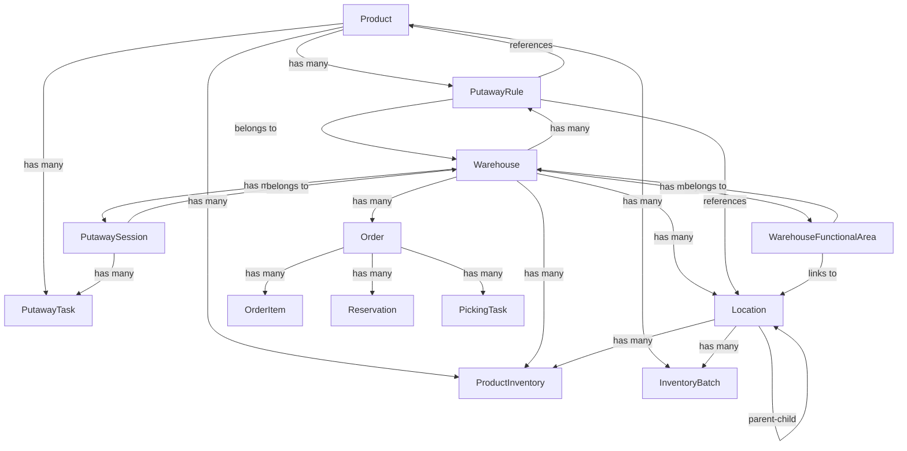

# Labamu WMS - System Architecture

**Version:** 1.0  
**Last Updated:** December 28, 2024  
**Status:** Production-Ready

---

## Table of Contents

1. [System Overview](#system-overview)
2. [Design Principles](#design-principles)
3. [Architecture](#architecture)
4. [Core Components](#core-components)
5. [API Structure](#api-structure)
6. [Data Model](#data-model)
7. [Security & Authorization](#security--authorization)
8. [Integration Points](#integration-points)

---

## System Overview

Labamu WMS is a comprehensive warehouse management system built on a modern, scalable architecture. The system manages end-to-end warehouse operations including inventory management, inbound/outbound logistics, picking, putaway, order fulfillment, and reporting.

### Technology Stack

| Layer | Technology |
|-------|------------|
| **Frontend** | Next.js 16 (React), TypeScript, TailwindCSS |
| **Backend** | NestJS (Node.js), TypeScript |
| **Database** | PostgreSQL / SQLite (via Prisma ORM) |
| **API Protocol** | REST (JSON) |
| **Authentication** | Cookie-based sessions with role-based access control (RBAC) |
| **Testing** | Playwright (E2E), Jest (Unit) |

---

## Design Principles

### 1. **Separation of Concerns**
- Clear separation between frontend (Next.js) and backend (NestJS)
- API proxy layer in Next.js routes requests to backend, avoiding CORS issues
- Business logic resides entirely in backend services

### 2. **Domain-Driven Design (DDD)**
- Modules organized by business domains (Inventory, Orders, Putaway, Picking, etc.)
- Each module contains Controllers, Services, and Domain Models
- Clear bounded contexts prevent tight coupling

### 3. **Location Hierarchy**
- All physical spaces modeled as `Location` entities with hierarchical relationships
- Supports warehouse structures: `WAREHOUSE → ROOM → ROW → BAY → SHELF → POSITION`
- Enables flexible spatial organization and zone-based optimization

### 4. **Flexible Putaway Strategy**
- **Rule-Based System**: Configurable `PutawayRule` entities with matching criteria and destination strategies
- **Fallback Heuristics**: Velocity-based location assignment when no rules match
- **5 Strategies**: FIXED, ZONE_PRIORITY, CLOSEST, LEAST_OCCUPIED, BALANCED

### 5. **Batch & Lot Tracking**
- Products support three tracking modes: `none`, `lot`, `serial`
- `InventoryBatch` provides granular traceability with lot numbers, expiry dates, and FEFO rotation
- First-Expired-First-Out (FEFO) and FIFO removal strategies

### 6. **Multi-Warehouse Support**
- All inventory, orders, and operations are warehouse-scoped
- Inter-warehouse transfers via `TransferOrder` and `StockMove`
- Warehouse-specific configurations (inbound/outbound steps, functional areas)

### 7. **Role-Based Access Control (RBAC)**
- Users assigned to warehouses with specific roles
- Permissions defined as `{resource}:{action}` (e.g., `INVENTORY:CREATE`)
- Fine-grained access control on all endpoints via `@Permission()` decorators

### 8. **Audit Trail**
- All inventory changes tracked via `StockTransaction`
- Immutable transaction records with timestamps and user attribution
- Full history for compliance and troubleshooting

---

## Architecture

### High-Level Architecture

```
┌─────────────────────────────────────────────────────────────┐
│                     Client Browser                           │
│                                                               │
│  ┌─────────────────────────────────────────────────────┐   │
│  │           Next.js Frontend (Port 3000)               │   │
│  │  • React Components (Pages, UI)                      │   │
│  │  • API Proxy Routes (/api/*)                         │   │
│  │  • Auth Context (useAuth)                            │   │
│  │  • Client-side State Management                      │   │
│  └──────────────────────┬──────────────────────────────┘   │
└─────────────────────────┼────────────────────────────────────┘
                          │ HTTP (JSON)
                          ▼
┌─────────────────────────────────────────────────────────────┐
│              NestJS Backend API (Port 3001)                  │
│                                                               │
│  ┌─────────────┐  ┌─────────────┐  ┌─────────────┐         │
│  │  Controller │  │  Controller │  │  Controller │  ...    │
│  │   Layer     │  │   Layer     │  │   Layer     │         │
│  └──────┬──────┘  └──────┬──────┘  └──────┬──────┘         │
│         │                 │                 │                │
│  ┌──────▼──────┐  ┌──────▼──────┐  ┌──────▼──────┐         │
│  │   Service   │  │   Service   │  │   Service   │  ...    │
│  │   Layer     │  │   Layer     │  │   Layer     │         │
│  └──────┬──────┘  └──────┬──────┘  └──────┬──────┘         │
│         │                 │                 │                │
│         └─────────────────┴─────────────────┘                │
│                           │                                   │
│                  ┌────────▼────────┐                         │
│                  │  Prisma Service │                         │
│                  │  (ORM Layer)    │                         │
│                  └────────┬────────┘                         │
└───────────────────────────┼──────────────────────────────────┘
                            │
                            ▼
                   ┌────────────────┐
                   │   PostgreSQL   │
                   │    Database    │
                   └────────────────┘
```

### Request Flow

1. **Client Request** → Next.js page makes API call
2. **API Proxy** → Next.js route (`/api/*`) proxies to NestJS backend
3. **Controller** → Validates request, checks permissions, delegates to service
4. **Service** → Executes business logic, interacts with database via Prisma
5. **Response** → Data flows back through proxy to client

---

## Core Components

### Backend Modules

| Module | Responsibility | Key Services |
|--------|---------------|--------------|
| **InventoryModule** | Product catalog, stock levels, adjustments | `InventoryService`, `PackagingService` |
| **PutawayModule** | Inbound putaway operations, rule-based location assignment | `PutawayService`, `PutawayController` |
| **OrderModule** | Sales orders, fulfillment, reservations | `OrderService`, `FulfillmentService` |
| **PurchaseOrderModule** | Purchase orders, receipts, vendor management | `PurchaseOrderService` |
| **PickingModule** | Order picking, picking sessions, task management | `PickingService` (integrated in Inventory) |
| **StrategyModule** | Reservation strategies, rotation rules | `StrategyService` |
| **WarehouseModule** | Warehouse configuration, locations, functional areas | `WarehouseService` |
| **SettingsModule** | Attributes, custom fields, system configuration | `AttributeService` |
| **AuthModule** | Authentication, user management, permissions | `AuthService` |
| **ReportingModule** | Analytics, dashboards, compliance reports, inventory ledger | `ReportingService`, `DrillDownService`, `InventoryLedgerService` |
| **IntegrationModule** | External system integrations, webhooks | `IntegrationService` |
| **StoModule** | Stock Transfer Orders (inter-warehouse) | `StoService` |
| **ShippingModule** | Carrier management, delivery methods | `ShippingService` |
| **InvoiceModule** | VAT invoicing, financial reporting | `InvoiceService` |
| **SupplierModule** | Supplier catalog, partner management | `SupplierService` |

### Frontend Structure

```
apps/web/
├── app/                         # Next.js App Router
│   ├── api/                     # API Proxy Routes
│   │   ├── auth/
│   │   └── inventory/
│   │       ├── putaway-rules/
│   │       └── putaway/
│   │           └── sessions/
│   ├── inventory/               # Inventory Pages
│   │   ├── products/
│   │   ├── locations/
│   │   ├── warehouses/
│   │   ├── adjustments/
│   │   └── putaway-rules/
│   ├── orders/                  # Order Management
│   ├── picking/                 # Picking Operations
│   ├── putaway/                 # Putaway Operations
│   ├── user-guide/              # Documentation
│   └── layout.tsx               # Root Layout
├── components/                  # Reusable UI Components
│   ├── ui/                      # shadcn/ui components
│   ├── Sidebar.tsx
│   └── auth/
│       └── PermissionGate.tsx
├── lib/                         # Utilities & API Clients
│   ├── api.ts                   # Core API client
│   ├── auth.tsx                 # Auth Context
│   └── putaway-api.ts           # Putaway-specific API
└── hooks/                       # Custom React Hooks
    └── usePermission.ts
```

### Important: API Proxy vs UI Routes

You'll notice that `putaway` and `putaway-rules` appear in **two different locations** in the structure above. This is intentional and serves different purposes:

#### 1. **API Proxy Routes** (`app/api/...`)
These are **server-side** Next.js API routes that proxy requests to the NestJS backend. They do not render any UI.

```
app/api/inventory/putaway-rules/   ← Returns JSON (API proxy)
app/api/inventory/putaway/sessions/ ← Returns JSON (API proxy)
```

**Purpose**:
- Forward frontend requests from port 3000 → backend port 3001
- Solve CORS issues (same-origin policy)
- Handle authentication cookies seamlessly
- Return raw JSON data to frontend components

#### 2. **UI Page Routes** (`app/...`)
These are **user-facing** pages that render React components and provide actual user interfaces.

```
app/inventory/putaway-rules/   ← Renders UI for managing rules
app/putaway/                   ← Renders UI for putaway operations
```

**Purpose**:
- Display forms, tables, buttons, and interactive elements
- Handle user interactions
- Call API proxy routes to fetch/update data

#### Example Request Flow

```
1. User visits: http://localhost:3000/inventory/putaway-rules
                ↓
2. [UI Page Route renders React components]
                ↓
3. User clicks "Create Rule" button
                ↓
4. Frontend calls: fetch('/api/inventory/putaway-rules', { method: 'POST', ... })
                ↓
5. [API Proxy Route] receives request on same domain
                ↓
6. Proxy forwards to: http://127.0.0.1:3001/inventory/putaway-rules
                ↓
7. [NestJS Backend] processes request, returns JSON
                ↓
8. Proxy returns JSON to frontend
                ↓
9. UI updates with new data
```

**Why This Pattern?**

In Next.js, you **cannot** call external APIs directly from browser JavaScript due to CORS (Cross-Origin Resource Sharing) restrictions. The `/api/*` routes run on the server-side within the Next.js application, allowing them to make backend calls without CORS issues. The frontend then calls these same-origin `/api/*` endpoints instead of directly calling the backend.


## API Structure

### REST Endpoint Conventions

All endpoints follow RESTful patterns:

```
GET    /resource          List all items
GET    /resource/:id      Get single item
POST   /resource          Create new item
PATCH  /resource/:id      Update existing item
DELETE /resource/:id      Delete item
POST   /resource/:id/action  Trigger action on item
```

### Core API Endpoints

#### Authentication
```
POST   /auth/login              Login user
POST   /auth/logout             Logout user
GET    /auth/me                 Get current user with roles/permissions
```

#### Inventory Management
```
GET    /inventory/products                  List products (with filters)
GET    /inventory/products/:id              Get product details
POST   /inventory/products                  Create product
PATCH  /inventory/products/:id              Update product
DELETE /inventory/products/:id              Delete product

GET    /inventory/batch/:productId          Get batches for product
POST   /inventory/adjust                    Create adjustment
GET    /inventory/transactions              Get transaction history
POST   /inventory/scrap                     Create scrap order
```

#### Warehouse & Locations
```
GET    /warehouses                          List warehouses
GET    /warehouses/:id                      Get warehouse details
POST   /warehouses                          Create warehouse
GET    /warehouses/:id/locations            Get location hierarchy
POST   /warehouses/:id/locations            Create location
PATCH  /locations/:id                       Update location
DELETE /locations/:id                       Delete location
```

#### Purchase Orders
```
GET    /purchase-orders                     List POs
GET    /purchase-orders/:id                 Get PO details
POST   /purchase-orders                     Create PO
PATCH  /purchase-orders/:id                 Update PO
POST   /purchase-orders/:id/receive         Receive PO items
POST   /purchase-orders/:id/close           Close PO
```

#### Sales Orders
```
GET    /orders                              List orders
GET    /orders/:id                          Get order details
POST   /orders                              Create order
PATCH  /orders/:id                          Update order
POST   /orders/:id/reserve                  Reserve inventory
POST   /orders/:id/unreserve                Release reservations
POST   /orders/:id/fulfill                  Mark as fulfilled
POST   /orders/:id/cancel                   Cancel order
```

#### Putaway Operations
```
POST   /inventory/putaway/sessions          Create putaway session
GET    /inventory/putaway/sessions/:warehouseId/active  Get active session
PATCH  /inventory/putaway/tasks/:id         Update putaway task
PATCH  /inventory/putaway/sessions/:id/complete  Complete session
GET    /inventory/putaway/tasks/blocked     Get blocked tasks
```

#### Putaway Rules
```
GET    /inventory/putaway-rules             List putaway rules
GET    /inventory/putaway-rules/:id         Get rule details
POST   /inventory/putaway-rules             Create rule
PATCH  /inventory/putaway-rules/:id         Update rule
DELETE /inventory/putaway-rules/:id         Delete rule
```

#### Picking Operations
```
POST   /inventory/picking/sessions          Create picking session
GET    /inventory/picking/sessions/:warehouseId/active  Get active session
PATCH  /inventory/picking/tasks/:id         Update picking task
PATCH  /inventory/picking/sessions/:id/complete  Complete session
```

### API Request/Response Formats

#### Standard Success Response
```json
{
  "id": "uuid",
  "name": "Product Name",
  "status": "Active",
  "createdAt": "2024-12-28T10:00:00Z"
}
```

#### Standard Error Response
```json
{
  "statusCode": 400,
  "message": "Validation failed: SKU already exists",
  "error": "Bad Request"
}
```

#### Pagination
```json
{
  "data": [...],
  "total": 150,
  "page": 1,
  "limit": 50
}
```

---

## Data Model

### Core Entities

#### Product
```typescript
Product {
  id: string (UUID)
  sku: string (unique)
  name: string
  category: string
  classification: string?  // ABC classification
  type: string?            // Raw, Finished, Semi-finished
  unitOfMeasure: string?
  isStockable: boolean
  status: string
  averageCost: float
  tracking: string         // none, lot, serial
  
  // Physical Dimensions
  width: float?  // cm
  height: float? // cm
  depth: float?  // cm
  weight: float? // kg
  
  // Warehouse Optimization
  velocity: string?        // A (Fast), B (Medium), C (Slow)
  abcClass: string?        // A (High value), B, C (Low value)
  
  // Storage Requirements (Phase 2)
  storageRequirements: string?  // JSON array
  temperatureMin: float?        // °C
  temperatureMax: float?        // °C
  preferredPackaging: string?   // PALLET, BOX, INDIVIDUAL
  stackable: boolean
  maxStackHeight: int?
  
  // Relations
  inventory: ProductInventory[]
  batches: InventoryBatch[]
  pickingTasks: PickingTask[]
  putawayTasks: PutawayTask[]
  putawayRules: PutawayRule[]
}
```

#### Location
```typescript
Location {
  id: string (UUID)
  name: string
  type: string  // VIEW, INTERNAL, VENDOR, CUSTOMER, etc.
  structuralType: string?  // WAREHOUSE, ROOM, ROW, BAY, SHELF, POSITION
  
  // Attributes & Configuration
  attributes: string?              // JSON (refrigerated, hazmat, etc.)
  supportedPackaging: string?      // JSON array
  removalStrategy: string?         // FIFO, LIFO, FEFO
  
  // Capacity
  maxVolume: float?  // m³
  maxWeight: float?  // kg
  
  // Floor Plan Coordinates
  x: float?
  y: float?
  width: float?
  height: float?
  rotation: float?
  
  // Optimization
  zonePriority: int      // 1 = Golden Zone, 100 = Back of house
  putawaySequence: int   // Traversal order within zone
  
  // Hierarchy
  parentId: string?
  parent: Location?
  children: Location[]
  warehouseId: string?
  
  // Relations
  inventory: ProductInventory[]
  batches: InventoryBatch[]
}
```

#### Warehouse
```typescript
Warehouse {
  id: string (UUID)
  name: string
  shortName: string?  // Max 5 chars for labeling
  address: string?
  location: string    // JSON: { lat, lng }
  type: string
  
  // Route Configuration
  incomingSteps: string?          // 1_step, 2_steps, 3_steps
  outgoingSteps: string?
  dropshipSubcontractors: boolean
  resupplySubcontractors: boolean
  manufactureToResupply: boolean
  manufactureSteps: string?
  
  // Relations
  inventory: ProductInventory[]
  orders: Order[]
  pickingSessions: PickingSession[]
  putawaySessions: PutawaySession[]
  putawayRules: PutawayRule[]
  functionalAreas: WarehouseFunctionalArea[]
}
```

#### WarehouseFunctionalArea (Auto-Created)
```typescript
WarehouseFunctionalArea {
  id: string (UUID)
  warehouseId: string
  warehouse: Warehouse
  
  // Area Definition
  name: string              // e.g. "Receiving Dock", "Main Storage"
  areaType: string          // RECEIVING, STAGING, PUTAWAY_LANE, STORAGE, PICKING, PACKING, SHIPPING
  sequence: int             // Order in process flow
  active: boolean
  
  // Linked Location
  linkedLocationId: string?
  linkedLocation: Location?  // The actual INTERNAL location for this functional area
  
  // Floor Plan Visualization
  x: float                  // Position coordinates
  y: float
  width: float
  height: float
  rotation: float
  color: string?            // Hex color for UI display
  
  attributes: string?       // JSON: capacity, equipment, etc.
  createdAt: DateTime
  updatedAt: DateTime
}
```

**Automatic Functional Area Creation**

When a warehouse is created, the system automatically creates functional areas and their linked locations based on the `incomingSteps` and `outgoingSteps` configuration:

| Configuration | Auto-Created Functional Areas | Linked Locations Created |
|---------------|-------------------------------|-------------------------|
| **1-step** (Default) | RECEIVING, STORAGE, SHIPPING | "Receiving Dock", "Main Storage", "Shipping Dock" |
| **2-steps** | RECEIVING, STAGING, STORAGE, PICKING, SHIPPING | "Receiving Dock", "Staging Area", "Main Storage", "Picking Zone", "Shipping Dock" |
| **3-steps** | RECEIVING, STAGING, PUTAWAY_LANE, STORAGE, PICKING, PACKING, SHIPPING | "Receiving Dock", "Staging Area", "Putaway Lane", "Main Storage", "Picking Zone", "Packing Station", "Shipping Dock" |

Each functional area:
- Gets a `WarehouseFunctionalArea` entry with explicit `areaType`
- Has a linked INTERNAL `Location` created automatically
- Is positioned on the warehouse floor plan for visualization
- Is identified by `areaType` enum (not name-based string matching)

**Benefits:**
1. **No Manual Setup Required**: Warehouses are immediately operational for putaway/picking
2. **Correct by Default**: Receiving locations always exist, preventing putaway errors
3. **Explicit Typing**: Uses `areaType` enum instead of fragile name matching
4. **Flexible**: Users can add more locations or functional areas later
5. **Process-Aligned**: Locations match the configured warehouse flow

#### PutawayRule (Phase 2 & 3)
```typescript
PutawayRule {
  id: string (UUID)
  name: string
  description: string?
  priority: int           // Higher = evaluated first
  active: boolean
  
  warehouseId: string?
  warehouse: Warehouse?
  
  // Matching Criteria (ALL must match)
  productId: string?
  product: Product?
  categoryId: string?
  velocityClass: string?      // A, B, C
  abcClassification: string?  // A, B, C
  storageRequirements: string?  // JSON array
  temperatureMin: float?
  temperatureMax: float?
  packagingSize: string?      // PALLET, BOX, INDIVIDUAL
  minWeight: float?
  maxWeight: float?
  sourceLocationId: string?   // Match items from specific receiving area
  
  // Destination Strategy
  strategy: string  // FIXED, ZONE_PRIORITY, CLOSEST, LEAST_OCCUPIED, BALANCED
  
  // Strategy-Specific Configuration
  destinationLocationId: string?  // For FIXED strategy
  minZonePriority: int?          // For ZONE_PRIORITY
  maxZonePriority: int?          // For ZONE_PRIORITY
  
  createdAt: DateTime
  updatedAt: DateTime
}
```

#### InventoryBatch
```typescript
InventoryBatch {
  id: string (UUID)
  productId: string
  product: Product
  
  locationId: string
  location: Location
  
  warehouseId: string
  warehouse: Warehouse
  
  quantity: float
  lotNumber: string?
  expiryDate: DateTime?
  
  // Quality Control
  status: string  // AVAILABLE, QUARANTINE, RESERVED, DAMAGED
  
  // Tracking
  createdAt: DateTime
  updatedAt: DateTime
}
```

#### Order
```typescript
Order {
  id: string (UUID)
  orderNumber: string (unique)
  customerId: string?
  customer: Customer?
  
  warehouseId: string
  warehouse: Warehouse
  
  type: string  // SALES, TRANSFER, PRODUCTION
  status: string  // DRAFT, PENDING, RESERVED, PICKING, PACKING, SHIPPED, DELIVERED, CANCELLED
  
  totalAmount: float
  currency: string?
  
  // Fulfillment
  reservationStatus: string  // NONE, PARTIAL, FULL
  fulfillmentStatus: string  // NONE, PARTIAL, FULL
  
  items: OrderItem[]
  reservations: Reservation[]
  pickingTasks: PickingTask[]
  
  createdAt: DateTime
  deliveryDate: DateTime?
}
```

#### StockTransaction
```typescript
StockTransaction {
  id: string (UUID)
  productId: string
  product: Product
  
  locationId: string
  location: Location
  
  transactionType: string  // IN, OUT, ADJUST, MOVE, RESERVE, UNRESERVE
  quantity: float
  
  batchId: string?
  batch: InventoryBatch?
  
  // References
  orderId: string?
  purchaseOrderId: string?
  adjustmentId: string?
  
  // Audit
  userId: string?
  notes: string?
  timestamp: DateTime
}

#### InventoryLedger (Virtual)
The Inventory Ledger is a derived view that unifies all inventory movements into a linear history for reporting. It does not have its own database table but aggregates data from:
1. **Receipts** (Inbound) - From `ReceiptItem`
2. **Orders** (Outbound) - From `Order` and `OrderItem`
3. **InventoryAdjustments** (Corrections)
4. **ScrapOrders** (Losses)

This virtual model enables:
- Accurate historical reconstruction
- Linkage to source documents (PO, Order #)
- Simplified pagination and CSV export via `InventoryLedgerService`
```

### Entity Relationships Diagram



---

## Security & Authorization

### Authentication Flow

1. **Login**: `POST /auth/login` → Server validates credentials, sets cookie with `user_id`
2. **Session**: Cookie automatically sent with every request
3. **Authorization**: Backend validates `user_id` header, loads user with roles/permissions
4. **Logout**: `POST /auth/logout` → Server clears cookie

### Role-Based Access Control (RBAC)

#### Permission Format
```
{resource}:{action}

Examples:
- INVENTORY:READ
- INVENTORY:CREATE
- INVENTORY:UPDATE
- INVENTORY:DELETE
- ORDER:FULFILL
- PUTAWAY:MANAGE
- ALL:MANAGE  (Super Admin)
```

#### Role Examples
```typescript
Role {
  name: "Warehouse Manager"
  permissions: [
    { resource: "INVENTORY", action: "READ" },
    { resource: "INVENTORY", action: "CREATE" },
    { resource: "INVENTORY", action: "UPDATE" },
    { resource: "ORDER", action: "READ" },
    { resource: "ORDER", action: "CREATE" },
    { resource: "PUTAWAY", action: "MANAGE" },
    { resource: "PICKING", action: "MANAGE" }
  ]
}
```

### Permission Decorators

Backend uses NestJS decorators for authorization:

```typescript
@Permission('INVENTORY', 'CREATE')
async createProduct(@Body() dto: CreateProductDto) {
  // Only accessible to users with INVENTORY:CREATE
}
```

Frontend uses `PermissionGate` component and `useAuth()` hook:

```tsx
const { hasPermission } = useAuth();

{hasPermission('INVENTORY', 'CREATE') && (
  <button onClick={createProduct}>Create</button>
)}
```

---

## Integration Points

### External Systems

| Integration | Purpose | Protocol |
|------------|---------|----------|
| **ERP Systems** | Sync orders, products, inventory | REST API, Webhooks |
| **Carrier APIs** | Shipping labels, tracking | REST API |
| **Accounting** | VAT reporting, invoicing | REST API |
| **E-commerce** | Order import, stock sync | Webhooks, REST |
| **WMS Hardware** | Barcode scanners, label printers | Device APIs |

### Webhooks

The system can send webhooks for key events:

```typescript
Events:
- order.created
- order.shipped
- inventory.low_stock
- putaway.session_completed
- picking.session_completed
```

### Import/Export

- **CSV Import**: Products, locations, inventory adjustments
- **CSV Export**: Inventory reports, transaction history
- **SAF-T Export**: Tax-compliant transaction exports

---

## Appendix

### Glossary

| Term | Definition |
|------|------------|
| **SKU** | Stock Keeping Unit - unique product identifier |
| **Lot/Batch** | Group of items with same production date/characteristics |
| **FEFO** | First-Expired-First-Out - pick items closest to expiry |
| **FIFO** | First-In-First-Out - pick oldest items first |
| **Zone Priority** | Numerical ranking of location accessibility (1 = best) |
| **Velocity** | Product movement speed (A=Fast, B=Medium, C=Slow) |
| **ABC Class** | Value-based classification (A=High value, C=Low value) |
| **Putaway** | Process of moving received goods to storage locations |
| **Picking** | Process of retrieving items for order fulfillment |

### Performance Considerations

- **Database Indexes**: All foreign keys, `sku`, `orderNumber`, `lotNumber`, `warehouseId`
- **Caching**: Consider Redis for frequently accessed data (products, locations)
- **Pagination**: All list endpoints support pagination (default: 50 items)
- **Query Optimization**: Prisma queries use `select` and `include` for optimal data fetching

### Future Enhancements

- [ ] Real-time inventory updates via WebSockets
- [ ] Mobile app for warehouse workers
- [ ] Advanced analytics with machine learning for demand forecasting
- [ ] Multi-tenant architecture for SaaS deployment
- [ ] Blockchain-based traceability for regulated industries
- [ ] Integration with IoT sensors for environmental monitoring

---

**Document End**
